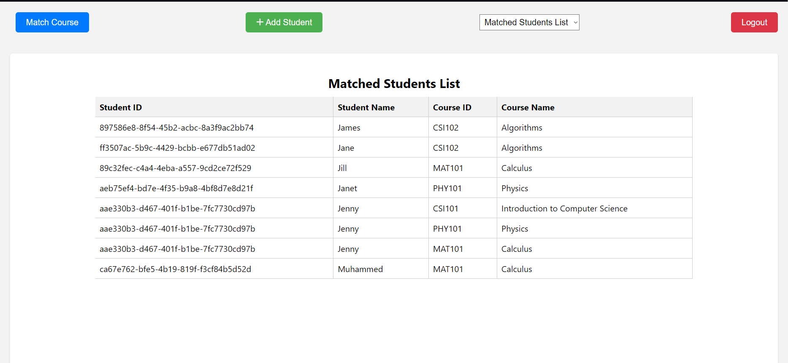
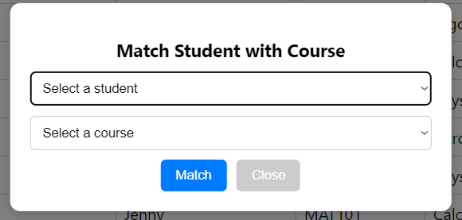

# KUSYS-Demo

A web project that works according to different authorizations, where you can choose a course and perform CRUD operations.

## Screenshots

Here are some screenshots from the project:


*Main admin screen*


*course selection screen*

## Getting Started

These steps include the basic instructions to run the project on your local machine and start developing.

### Prerequisites

Make sure you have the following software installed to start the project:

- Node.js
- PostgreSQL

### Installation

1. Clone the project repository to your local machine:

   ```sh
   git clone https://github.com/Muhammed-Ozberk/KUSYS-DEMO.git
   ```

2. Navigate to the project folder:

   ```sh
   cd project-name
   ```

3. Install the required dependencies for the backend:

   ```sh
   cd backend
   npm install
   ```

4. Create a PostgreSQL database and update the connection settings in the backend/config/database.js file.

   ```json
   // backend/config/database.js
   {
     "development": {
        "username": "username",
        "password": "password",
        "database": "database_name",
        "host": "localhost",
        "dialect": "postgres"
      }
   }

   ```

5. After updating the database, use the following commands to create the database tables:

   ```sh
   cd backend
   npx sequelize-cli --config=config/database.js db:create
   npx sequelize-cli --config=config/database.js db:migrate
   ```

6. Start the backend server:

   ```sh
   cd backend
   npm start
   ```

7. Open a new terminal window, navigate to the project folder, and install the required dependencies for the frontend:
  
   ```sh
   cd frontend
   npm install
   ```

8. Start the frontend application:

   ```sh
   cd frontend
   npm start
   ```

9. To view the application in your browser, visit the following URL:

   ```arduino
   http://localhost:3000
   ```


## License

[MIT]